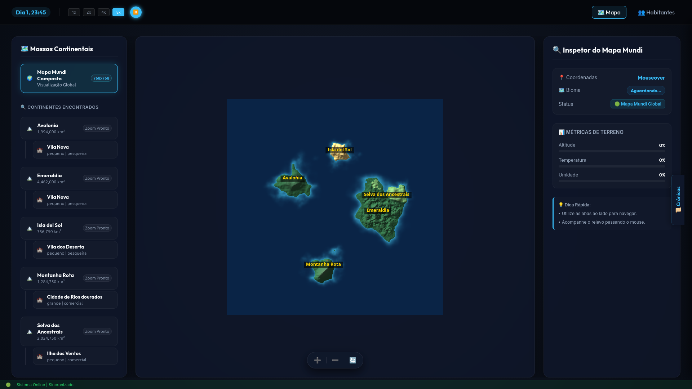
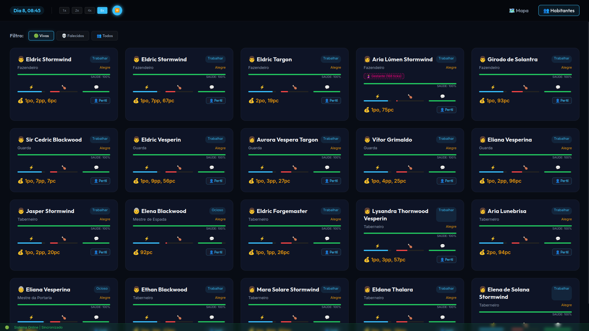

# 🌍 OpenWorld Engine: Autonomous City Simulation

| Mapa | NPCs |
| :---: | :---: |
|  |  |

OpenWorld é um motor de simulação de mundo autônomo e emergente projetado para suporte a RPG de mesa e mundos persistentes. A engine combina **Utility AI** (lógica matemática para decisões) com **Inteligência Artificial Generativa** (LLMs locais via Ollama) para criar uma experiência orgânica onde habitantes vivem, trabalham, envelhecem e formam famílias de forma totalmente independente.

## 🚀 Estado Atual: Dinâmicas Geracionais & Escala (v9.0)

O projeto evoluiu de uma simulação básica de economia para um ecossistema geracional dinâmico. O sistema agora possui escala paralela e uma UI fluida e responsiva para suportar metrópoles complexas.

### 🌟 Funcionalidades Principais
*   **Ciclo de Vida Biológico Autônomo**: NPCs nascem, crescem, envelhecem e morrem de velhice. A simulação lida de forma autônoma com acasalamento, tempo de gestação e passagem de heranças.
*   **Geração de Conteúdo Paralela (IA)**: Utilização de *Thread Pools* para acionar múltiplos workers no Ollama, destruindo tempos de carregamento durante a criação do mundo.
*   **Dashboard e Cartografia Dinâmica**: Renderização de ponta no frontend baseada em matrizes `.npz` de alta resolução geológica (768x768). O dashboard faz auto-zoom dinâmico (ROI Zoom de 1200x1200px) focado em Cidades e Continentes.
*   **Mercado de Trabalho Inteligente**: Sistema de contratação que vincula NPCs a locais de trabalho baseados em suas características, com penalidades por exaustão.
*   **Persistência Híbrida de Tempo Real**: Sincronização em tempo real entre o estado em memória (RAM) e o banco de dados (SQLite). O Dashboard lê essas mudanças a cada segundo via Web API.
*   **Batizado Assíncrono**: Bebês nascem com nomes genéricos e recebem nomes elaborados pela IA no background, sem paralisar a engine física de ticks.

---

## ⚠️ Aviso de Escala e Superpopulação

Devido à aceleração do tempo na engine (onde um NPC atinge a fase adulta muito rápido para fins de teste), **a taxa de natalidade do mundo é altíssima**. Casais com alta afinidade têm até 20% de chance por noite de conceber uma criança, o que pode gerar uma explosão demográfica (e exaustão metabólica generalizada, pois criar filhos drena muita energia).

Se sua metrópole estiver sofrendo um "boom" populacional incontrolável, você pode ajustar as leis biológicas diretamente no arquivo `config.json`. Modifique a seção `biologia_e_sociedade`:

*   **Para retardar o crescimento populacional**: Diminua a `"concepcao_chance"` de `0.20` para `0.05` ou `0.02`.
*   **Para atrasar a idade adulta**: Aumente `"crescimento_dias_crianca_para_adulto"` (ex: 15 ou 20 dias).
*   **Para dificultar as uniões**: Aumente `"concepcao_afinidade_minima"` para `90` ou mais.

---

## 🏗️ Como Iniciar o Mundo

### 1. Requisitos
*   **Python 3.10+**
*   **Ollama** rodando localmente com o modelo `qwen2.5-coder:7b` (ou o que desejar em seu projeto).

### 2. Reset e Construção do Mundo
Para criar um novo mundo (Cartografia Avançada + População IA multi-thread), digite:
```bash
./builder/reset_world.sh
```
*(O script aciona automaticamente a reconstrução topológica e o script de povoamento em lote com a IA).*

### 3. Rodar a Simulação & Visualizar
Em um terminal, rode o motor:
```bash
python3 run_simulation.py
```
Em outro terminal, inicie o Dashboard:
```bash
python3 run_dashboard.py
```
Acesse `http://127.0.0.1:5000` para ver sua vila ganhar vida em tempo real!

---

## 📂 Estrutura do Ecossistema

*   **`engine/` (O Cérebro)**: Motor principal de física, ciclos de vida (`reproduction.py`, `lifecycle.py`), mercado de trabalho e Utility AI de movimentos.
*   **`cartographer/` (A Geologia)**: Pipeline massiva em Python/Numpy para geração de relevo, clima, oceanos e cidades (Perlin Noise e ROI Zoom).
*   **`builder/` (A População)**: Scripts de inicialização, povoamento com IA (`populate.py`) e batismo (`storyteller.py`).
*   **`web/` (Os Olhos)**: Interface web em Flask e Vanilla JS/CSS com renderização nativa em canvas 2D.
*   **`database/`**: Armazenamento do mundo persistente, incluindo SQLite e os mapas baseados em arrays (`.npz`).

---

## 🛠️ Tecnologias Utilizadas
- **Python 3** (Lógica Core, Engine Física, Rotas de API)
- **Ollama / LLM** (Geração de Identidades e Nomes)
- **Flask** (Servidor do Dashboard de Telemetria)
- **Vanilla JS & CSS3** (Grid dinâmico, animações, chamadas assíncronas)
- **SQLite** (Banco de Dados Relacional Rápido)
- **Bash** (Automação de Infraestrutura)

---
*OpenWorld: Onde cada pixel tem uma história, cada habitante tem um plano, e a evolução não para.*
