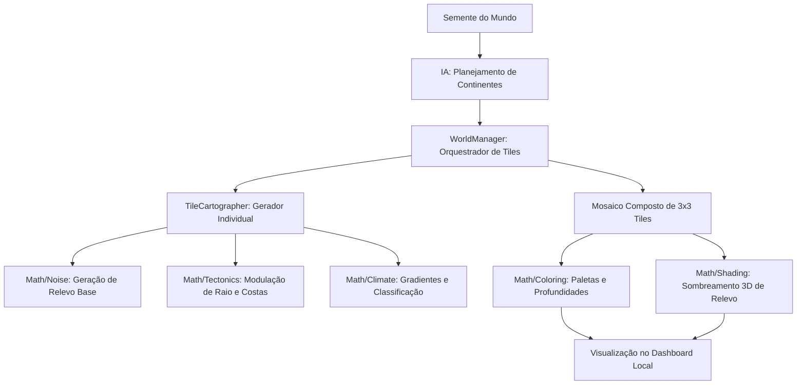

# 🗺️ Cartógrafo Procedural 3D & Gerador Tectônico Orgânico (AAA)

Este é o módulo geográfico e climatológico mestre do **OpenWorld**. Ele é responsável por projetar a macro-geografia planetária combinando planejamento estratégico via Inteligência Artificial local (Ollama) com uma pipeline de processamento matemático altamente otimizada, determinística e contínua em Python/Numpy.

O sistema gera mapas em formato de mosaico de tiles (fatiamento infinito), renderizando relevo montanhoso tridimensional de alta fidelidade e climatologia baseada nas leis da física terrestre.

---

## 📁 Arquitetura de Diretórios e Módulos

O módulo foi projetado sob os mais rigorosos princípios de clean code, separando completamente a camada de controle, planejamento e os processadores de equações matemáticas:

```
cartographer/
├── README.md                         # Documentação técnica detalhada (Este arquivo)
├── generate_world.py                 # Script mestre para execução e salvamento do mapa composto (.npz)
├── tile_cartographer.py              # Classe principal que gera os dados de tiles individuais [256x256]
├── world_manager.py                  # Gerente de carregamento sob demanda e junção de tiles
│
├── ai/                               # Planejamento Estratégico via IA
│   ├── prompt/
│   │   └── world_map_generation.txt  # Template de prompt com regras geográficas rígidas
│   └── world_manager_ai.py           # Cliente da IA com fallback determinístico robusto
│
└── math/                             # Motores Matemáticos Centralizados (Vetorizados via Numpy)
    ├── __init__.py                   # Exportador limpo dos submódulos
    ├── noise.py                      # Gerador de campos Perlin coerentes multi-frequência
    ├── tectonics.py                  # Máscaras de continentes, raios variáveis e curvas Vignette
    ├── climate.py                    # Latitude, temperatura, umidade e classificação de biomas
    ├── shading.py                    # Sombreamento vetorial 3D Northwest (Hillshading)
    └── coloring.py                   # Renderização de profundidade marinha e paletas altitudinais
```

---

## ⚙️ Funcionamento da Pipeline de Geração

A criação do mundo é executada de forma decrescente, partindo da macro-estratégia global até o sombreamento de cada pixel:



---

## 🧠 Detalhamento Técnico das Camadas

### 1. Planejamento Estratégico via IA (`cartographer/ai/`)
A geração não se baseia em simples números aleatórios. Um modelo de linguagem local (Ollama) atua como um projetista geográfico de alta precisão através de um prompt estruturado em formato de contrato rígido:
*   **Parâmetros Gerados**: Coordenadas de centro, áreas de massa de terra (em km²), perfis geológicos exclusivos (Alpino, Platô, Arquipélago, Erosivo) e modificadores de calor/umidade.
*   **Fallback Determinado**: Se a conexão com a IA falhar ou o JSON gerado for inválido, o sistema aciona um gerador procedural determinístico baseado na semente original, garantindo robustez contínua.

### 2. Geração Contínua de Relevo (`cartographer/math/noise.py`)
Utiliza funções matemáticas coerentes de **Perlin Noise** com diferentes frequências (oitavas) para garantir que as montanhas e costas continuem perfeitamente alinhadas entre as bordas de diferentes tiles:
*   **Camada Macro (Placas Tectônicas)**: Frequência ultrabaixa para formas globais de relevo.
*   **Camada Micro (Detalhes)**: Alta frequência para fraturas locais, picos secundários e rugosidades.

### 3. Modelação Tectônica de Margens (`cartographer/math/tectonics.py`)
Para que o mundo não seja composto por simples círculos geométricos perfeitos, implementamos:
*   **Modulação de Raio Tectônico**: O raio continental de influência de cada massa de terra é dinamicamente modificado em tempo real pelo ruído de placas tectônicas:
    $$raio\_dinamico = R \times (0.65 + 0.75 \times ruido\_macro)$$
    Isso força a criação de formas extremamente ricas como baías imponentes, cabos e estreitos terrestres.
*   **Distorção Costeira**: Ruídos de alta frequência são somados à distância euclidiana da costa para simular fiordes e recortes rochosos.
*   **Máscara Vignette de Cosseno**: Evita o corte abrupto de terras nas bordas do mapa mestre, suavizando o relevo de volta ao oceano através de uma transição trigonométrica suave:
    $$fator\_borda = 0.5 \times (1.0 - \cos(dist\_borda \times \pi))$$

### 4. Climatologia Dinâmica (`cartographer/math/climate.py`)
Modelagem climática baseada em gradientes físicos reais:
*   **Gradiente Latitudinal**: A temperatura diminui gradativamente conforme a coordenada Y se afasta do equador global do planeta.
*   **Damping de Altitude**: A temperatura cai proporcionalmente à elevação ($Altitude \times 0.4$), simulando perfeitamente montanhas geladas.
*   **Matriz de Biomas**: Classificação de pixels em tempo real nos seguintes biomas: `Oceano`, `Deserto`, `Mediterrâneo`, `Floresta Temperada` e `Montanha Rochosa`.

### 5. Renderização e Profundidades (`cartographer/math/coloring.py`)
A água do mar é modelada dinamicamente usando uma curva de atenuação exponencial de potência 6:
*   **Glowing Reefs**: Próximo à costa (água rasa), o oceano assume um tom turquesa brilhante e translúcido. Conforme a profundidade aumenta em direção ao mar aberto, a coloração se torna rica, densa e azul-escura.
*   **Interpolação Altitudinal de Biomas**: Na terra firme, a coloração transiciona gradualmente dependendo do bioma e da altitude (ex: Verde Rico -> Rocha Escura -> Neve Branca nos picos mais elevados).

### 6. Sombreamento Vetorial 3D - Hillshading (`cartographer/math/shading.py`)
Para fornecer ao mapa um aspecto premium, tridimensional e digno de jogos de estratégia de ponta:
*   Calculamos os gradientes parciais ($dx, dy$) de altitude de cada pixel.
*   Projetamos uma fonte de luz vinda estritamente de Noroeste ($\vec{L} = [-1.0, -1.0, 0.4]$).
*   Efetuamos o produto escalar entre o vetor da luz e a normal da superfície de relevo, gerando sombras profundas nas encostas voltadas a sudeste e destaques iluminados e nítidos nas faces voltadas a noroeste.

---

## ⚡ Como Executar a Geração

Para rodar a pipeline mestre e gerar o arquivo de mapa composto para o simulador e dashboard, execute o comando na raiz do projeto:

```bash
python3 cartographer/generate_world.py
```

Isso criará ou atualizará o arquivo compactado `database/mapa_composto.npz` de forma instantânea.
